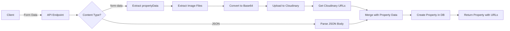

# Property Image Upload Guide

## 🎯 Quick Comparison

### ❌ Old Way (Difficult)

```
Step 1: Upload images
  POST /api/upload/images
  → Get URLs: ["url1", "url2", "url3"]

Step 2: Copy URLs manually

Step 3: Create property
  POST /api/properties
  Body: {
    "title": "Villa",
    "images": ["url1", "url2", "url3"],  ← Manual copy/paste
    ...
  }

Problems:
- Multiple requests
- Manual URL copying
- Easy to make mistakes
- Orphaned images if step 3 fails
```

### ✅ New Way (Easy!)

```
POST /api/properties
Content-Type: multipart/form-data

Form Data:
├─ propertyData: { "title": "Villa", ... }
├─ images: file1.jpg
├─ images: file2.jpg
└─ images: file3.jpg

→ Property created with Cloudinary URLs automatically saved!

Benefits:
- ONE request
- Automatic upload
- No manual copying
- Cleaner workflow
- No orphaned images
```

## 🚀 How to Use in Postman

### Step-by-Step Guide

1. **Open Postman** and select: "Create Property with Images (Form Upload)"

2. **Click Body Tab** → Select "form-data"

3. **Add Property Data**:

   ```
   Key: propertyData
   Type: Text
   Value: <paste JSON below>
   ```

4. **Property JSON Template**:

   ```json
   {
     "title": "Your Property Title",
     "description": "Property description",
     "price": 1000000,
     "transactionType": "buy",
     "propertyType": "villa",
     "beds": 4,
     "baths": 3,
     "size": 3000,
     "furnishingStatus": "furnished",
     "propertyFeatures": ["Private Pool", "Garden"],
     "seller": {
       "name": "Your Name",
       "job": "Real Estate Agent",
       "phone": "+1-555-1234",
       "email": "agent@example.com"
     },
     "location": {
       "address": "123 Main Street",
       "city": "Dubai",
       "state": "Dubai",
       "zipCode": "12345",
       "country": "UAE"
     },
     "amenities": ["Parking", "Security"],
     "status": "available",
     "featured": true
   }
   ```

5. **Add Images**:

   - Click "Add Key" for each image
   - Key: `images` (repeat for each file)
   - Type: Select "File" from dropdown
   - Value: Click "Select Files" → Choose image

6. **Set Authorization**:

   - Go to "Headers" tab
   - Authorization: `Bearer {{admin_token}}`

7. **Send Request** → Done! 🎉

## 📸 Visual Example

### Postman Form Data Setup

```
┌─────────────────────────────────────────────────┐
│ Body: form-data                                 │
├──────────────┬──────────┬───────────────────────┤
│ KEY          │ TYPE     │ VALUE                 │
├──────────────┼──────────┼───────────────────────┤
│ propertyData │ Text     │ { "title": "Villa"... }│
│ images       │ File     │ [Select Files] villa1.jpg│
│ images       │ File     │ [Select Files] villa2.jpg│
│ images       │ File     │ [Select Files] villa3.jpg│
└──────────────┴──────────┴───────────────────────┘
```

## ✅ Success Response

```json
{
  "success": true,
  "data": {
    "id": "65abc123...",
    "title": "Your Property Title",
    "price": 1000000,
    "images": [
      "https://res.cloudinary.com/your-cloud/image/upload/v1234/properties/abc123.jpg",
      "https://res.cloudinary.com/your-cloud/image/upload/v1234/properties/def456.jpg",
      "https://res.cloudinary.com/your-cloud/image/upload/v1234/properties/ghi789.jpg"
    ],
    "beds": 4,
    "baths": 3,
    "seller": {
      "name": "Your Name",
      ...
    },
    ...
  },
  "message": "Property created successfully with 3 image(s) uploaded"
}
```

## 🔧 Technical Details

### What Happens Behind the Scenes



### File Processing

1. **File Upload**: Browser sends files as multipart/form-data
2. **Buffer Conversion**: Files → ArrayBuffer → Buffer
3. **Base64 Encoding**: Buffer → Base64 string
4. **Cloudinary Upload**: Base64 → Cloudinary
5. **URL Storage**: Cloudinary URLs → Property.images array

## 🎨 Frontend Integration Example

### HTML Form

```html
<form id="propertyForm" enctype="multipart/form-data">
  <input type="text" name="title" placeholder="Property Title" required />
  <input type="number" name="price" placeholder="Price" required />
  <input type="file" name="images" multiple accept="image/*" required />
  <button type="submit">Create Property</button>
</form>

<script>
  document
    .getElementById("propertyForm")
    .addEventListener("submit", async (e) => {
      e.preventDefault();

      const formData = new FormData();

      // Collect property data
      const propertyData = {
        title: e.target.title.value,
        price: Number(e.target.price.value),
        transactionType: "buy",
        propertyType: "villa",
        beds: 4,
        baths: 3,
        size: 3000,
        furnishingStatus: "furnished",
        propertyFeatures: [],
        seller: {
          name: "Agent Name",
          job: "Real Estate Agent",
          phone: "+1-555-1234",
          email: "agent@example.com",
        },
        location: {
          address: "123 Main St",
          city: "Dubai",
          state: "Dubai",
          zipCode: "12345",
          country: "UAE",
        },
      };

      formData.append("propertyData", JSON.stringify(propertyData));

      // Add files
      const files = e.target.images.files;
      for (let file of files) {
        formData.append("images", file);
      }

      // Submit
      const response = await fetch("/api/properties", {
        method: "POST",
        headers: {
          Authorization: `Bearer ${token}`,
        },
        body: formData,
      });

      const result = await response.json();
      console.log("Success!", result);
    });
</script>
```

## ❓ FAQ

### Q: Can I still use the old JSON method?

**A:** Yes! Both methods work. JSON-only is still supported for backward compatibility.

### Q: How many images can I upload at once?

**A:** No hard limit in the code, but practical limit is around 10-20 images depending on file sizes and Cloudinary plan.

### Q: What image formats are supported?

**A:** All common formats: JPG, JPEG, PNG, GIF, WEBP, SVG, etc.

### Q: Can I mix uploaded files with existing URLs?

**A:** Yes! The API merges uploaded files with any URLs in the `propertyData.images` array.

### Q: What happens if image upload fails?

**A:** The entire request fails and property is not created. You'll get an error message.

### Q: Can I upload images after creating the property?

**A:** Yes, use the UPDATE endpoint with the same form-data approach.

## 🚨 Common Errors

### Error: "Missing propertyData field"

```
Fix: Make sure form field is named exactly "propertyData"
```

### Error: "Invalid JSON in propertyData field"

```
Fix: Check JSON syntax, use JSON validator
```

### Error: "Failed to upload image"

```
Fix: Check Cloudinary credentials in .env file
Verify: CLOUDINARY_CLOUD_NAME, CLOUDINARY_API_KEY, CLOUDINARY_API_SECRET
```

### Error: "Unauthorized"

```
Fix: Include valid Bearer token in Authorization header
```

## 📋 Checklist

Before sending request:

- [ ] Logged in and have valid token
- [ ] Form-data body type selected
- [ ] `propertyData` field with valid JSON
- [ ] Image files selected (optional but recommended)
- [ ] Authorization header with Bearer token
- [ ] All required property fields included

## 🎉 Success Tips

1. **Test with Small Images First**: Use small test images initially
2. **Validate JSON**: Use JSON validator before pasting into propertyData
3. **Check Response**: Verify `images` array has Cloudinary URLs
4. **Save Property ID**: The response includes the property ID for future updates

## 📚 Related Docs

- [Complete Guide](./CREATE-PROPERTY-WITH-IMAGES.md) - Detailed documentation
- [Property Fields](./PROPERTY-FIELDS-GUIDE.md) - All required fields
- [Cloudinary Setup](./CLOUDINARY-SETUP-SUMMARY.md) - Configuration

---

**Happy Property Creating! 🏠✨**
